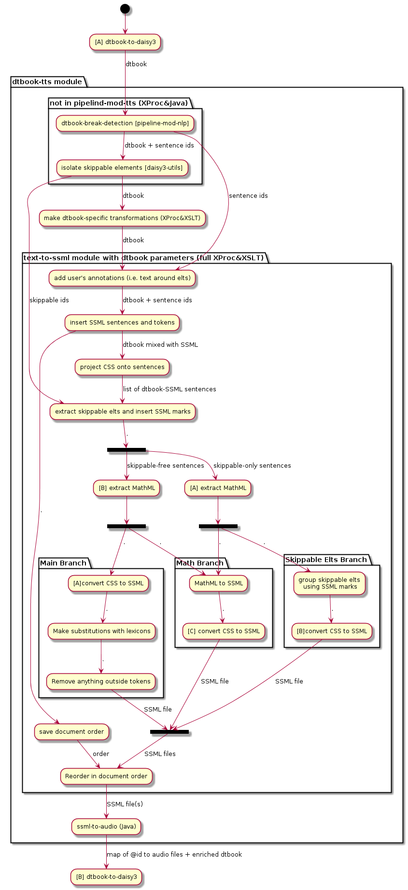

# Developer notes on TTS in DAISY Pipeline

Warning: some information in this README might be out-of-date!

## Processing flow

Below is a graph visualisation of the process at some point in the
past (some things have changed since!):



[plantuml source](tts.uml)

CSS inlining is performed on the input documents, while NLP and TTS
steps are always performed on the output documents. For instance, in
the DTBook to EPUB 3 script, CSS is inlined in the DTBook document
whereas NLP and TTS is performed on the HTML files. This is done
because:

- We don't want to risk losing @id's in the process of converting
  DTBook to EPUB 3. @id's are our only links to audio clips ;
- Some new text might have been generated during the conversion,
  e.g. "table of contents" ;
- Some text might have been isolated from their surrounding structure,
  which may include @id's ;
- Although it would be much simpler to also apply CSS on the output
  documents, users are only fully aware of the input document, so it
  makes sense for them to write a style sheet targeted for the
  input. CSS information is carried by special attributes that
  hopefully won't be discarded during the conversions.

After the step "project CSS onto sentences", the XML transferred from
one transformation to another always looks like:

```xml
<speak version="1.1" xmlns="http://www.w3.org/2001/10/synthesis">
       <s id="fj73d78f">...</s>
       <s id="fd998h3m">...</s>
</speak>
```

At the end, the TTS step returns a list of audio clips:

```xml
<audio-clips xmlns="http://www.daisy.org/ns/pipeline/data">
   <clip idref="std1472e384061"
         clipBegin="0:00:00.000"
         clipEnd="0:00:00.581"
         src="file:/tmp/section0508_0000.mp3"/>
   <clip idref="std1472e384067"
         clipBegin="0:00:00.581"
         clipEnd="0:00:01.257"
         src="file:/tmp/section0508_0000.mp3"/>
</audio-clips>
```

@idref is the id of an element of the original document: most likely a
sentence, sometimes a skippable element. The map is then used to
generate SMIL-like files. The conversion scripts should call
`px:rm-audio-files` after everything has been copied to the output
directory.

## Skippable elements

Skippable elements are element that we want to be able to skip when
desired. Their exact boundaries within the audio clips must be
known. Typical use cases are pagenums, annorefs and noterefs in DAISY
3.

Skippable elements are isolated from their surrounding text, and
processed separately, so that the prosody of the surrounding text is
not affected. SSML marks are inserted in the surrounding text. Note
that SSML marks are not supported by every TTS processor, which may
have a negative effect on the prosody of the surrounding text.

Sentences that contain skippable elements are broken up into parts
wrapped in spans. E.g. in case of a DTBook noteref:

```xml
<sent id="sent1"><span id="span1">begin</span><noteref id="ref1">note1</noteref><span id="span2">end</span></sent>"
```

Later, the noteref is replaced with a SSML mark, like this:

```xml
<sent id="sent1"><span id="span1">begin</span><ssml:mark name="span1__span2"><span id="span2">end</span></sent>"
```

The mark's name contains information about where the sub-sentences
begin and where they end. In the resulting audio map, there will be
two clips:

```xml
<audio-clips xmlns="http://www.daisy.org/ns/pipeline/data">
   <clip idref="span1"/>
   <clip idref="span2"/>
</audio-clips>
```

The skippable elements are transferred from their host sentence to a
separate document dedicated to them. In order to save resources, we
group them together in long sentences such as this one:

```xml
<ssml:s>note1<ssml:mark name="ref1__ref2">note2<ssml:mark name="ref2__ref3">note3</ssml:s>"
```

This example will result in three clips in the audio map:

```xml
<audio-clips xmlns="http://www.daisy.org/ns/pipeline/data">
   <clip idref="ref1"/>
   <clip idref="ref2"/>
   <clip idref="ref3"/>
</audio-clips>
```

Note that if a sentence contains nothing more than a single skippable
element, the skippable element won't be extracted and will be treated
as a regular sentence inside the skippable-free document.

## SSML partitioning

Before dispatching the sentences to threads, The ssml-to-audio step
groups them together by packets of 10 or so. The goal here is to make
it likely to encode adjacent text in the same audio files. This can be
improved in future versions by:

- taking into consideration the size of the SSML sentences
- building packets according to levels, sections and chapters. This
  was actually the behavior at some point, but it came with a cost
  regarding the coupling between ssml-to-audio and text-to-ssml, plus
  the post-processing when chapters are too big to take benefit of the
  multithreaded architecture.

Once the SSML sentences are gathered in packets, packets are ordered
in such a manner that the packet-consumer threads should finish
simultaneously.

## Job cancellation

Running jobs cannot be canceled, but it can happen that the Pipeline
server is requested to stop gracefully. The TTS modules are built so
that the TTS resources can be invalidated during running jobs. In such
cases, the TTS threads will keep popping text packets but they won't
process them. As a result, they will exit quickly and the deallocation
callbacks will be called no matter what problems occurred.

## Multi-threading and memory management

There are threads for synthesizing text and other threads for the
audio encoding. Separating tasks has the advantage of speeding up a
bit some adapters such as Acapela's. In the Acapela adapter, a TCP
channel is opened for each thread, but Acapela's licenses set a limit
of speed for every channel (i.e. an output rate in bytes per TCP
socket). So either we open, initialize and close channels for every
request sent to Acapela's server, or we let the channels open but we
make sure to keep them busy so that we never find ourselves not using
the maximum rate that Acapela granted us, as when we are encoding
audio. In that way, threads dedicated to synthesizing get close to the
speed limit.

The drawback of this method, by contrast to synthesizing and encoding
in the same threads, is that it may lead to memory overflows if the
encoding threads are slower than the synthesizing ones. To address
this problem, the size of the audio queue is limited by the permits of
a semaphore, which is shared by all the running jobs.

Yet there can remain memory issues if all the synthesizing threads
wait for the semaphore at the same time with full audio buffers. We
can't use another semaphore to limit the production of audio buffers
because, if the threads reach the memory limit before reaching the
flushing point -when they send their data to the encoding threads-,
the encoding threads will starve. Instead, if the memory limit is
reached, a custom memory exception is thrown, before an authentic
OutOfMemoryError is thrown from an unexpected place. The exception
doesn't stop the thread from trying to synthesize the next pieces of
text.

Both mechanisms are handled by an AudioBufferAllocator that counts
every byte allocated and deallocated.

Audio buffers can contain any kind of data (8-bits, 16-bits, 8kHz,
16kHz and so on). The current format is determined by the TTS engine
that produced the data. Since the buffers are flushed when formats
change, there is no need for re-sampling the data.

## Voices

The `voice-family` CSS property allows users to influence the voice
selection. The Voice Manager is asked which voice is the best match
for a certain language and `voice-family` list.

The voice selection algorithm works as follows:

FIXME: verify whether this is still accurate!

### Case 1: one or more criteria are supplied: language, gender, engine

To reply to such a request, the Voice Manager precomputes 4 lists,
each ordered by descending priority:

- one that tries to match language, gender and engine
- one that tries to match language and engine
- one that tries to match language and gender
- one that tries to match language only

The algorithm checks the given criteria against these lists one after
the other and returns the first voice that matches. In other words, a
low-priority voice V1 will be chosen over a high-priority voice V2 if
V1 is provided by the engine requested by the end-user.

If no voice is found, it will return the best voice that provides the
language "*", if there is any such voice registered. These voices are
called "multi-lang voices." in the code.

### Case 2: the full name of the voice is supplied by the end-user

If the name is found, the corresponding voice is simply returned. If
it isn't, the Pipeline will try finding a similar voice as long as it
is aware of the characteristics (gender, engine and language) to look
for, i.e. those of the voice that cannot be found.

The link between a voice and its fallback counterpart is precomputed
and stored in a map. Although this map would theoretically do the same
job as in the 1st case, the code of the 1st case is not used for
generating the map (this is an enhancement that we could think
about). The only difference is that multi-lang voices compete with
regular voices within the 4 lists.

If yet not fallback voice is found, the algorithm will ignore the
voice explicitly requested and instead extract new criteria from the
'voice-family' attribute. If other criteria do exist, then it will
switch to case 1.

### Case 3: a voice has been selected, but it doesn't work on the current sentence because of a timeout or for any other reason

This case is equivalent to the case 2 when the voice is not found.

## MathML

MathML 3.0 is currently handled by MathCAT.

An older implementation is used as fallback and lives in the
mathml-utils module. Content MathML is converted into Presentation
MathML using a third-party XSLT. Presentation MathML is then converted
to SSML.

The conversion relies on an XML file that defines how to deconstruct
MathML, much as how you would extract information using regexp groups
and build language-dependent SSML from the matching groups.
Internally, these rules are converted into regexps, thus everything
that can't be done using regexps, can't be done with those rules
either. It would have been more powerful with XSLT rules, but
regexp-like rules has been preferred for the sake of simplicity,
especially when it comes to combining matching and extraction.

Although there are rules to convert ASCII symbols (e.g. '+' and '-'),
there aren't rules to convert complex UTF-8 symbols such as ℝ and
∬. It is the responsibility of the TTS processors to properly
pronounce such symbols. eSpeak has a limited preset of symbols,
whereas Acapela seems to pronounce them all. It has never been tested
with other engines.

## Known limitations

- Relative CSS properties (e.g. increase/decrease volume) are not
  interpreted;
- SSML elements outside the scope of sentences are not kept;
- TTS engines that cannot handle SSML marks, will produce audio with
  wrong prosody and we won't be able to automatically check that the
  input text has been entirely synthesized;
- Remote TTS engines must share the same configuration (installed
  voices, sample rates etc.) or at least the 'master' server must be
  configured with the minimal configuration;
- TTS processors can provide different audio formats, but the same
  engine must always provide the same format. If different voices of
  the same processor use different formats, it is the responsibility
  of the TTS adapter to re-sample the data before sending them to the
  TTS threads;
- There isn't a way for end-users to pass custom XML markups from
  their books to TTS processors. If there is any non-SSML nodes in the
  input, they will be filtered out in text-to-ssml. Even if they were
  left intact by text-to-ssml, they risk being removed by the SSML
  serializers of the TTS engines' adapters.
