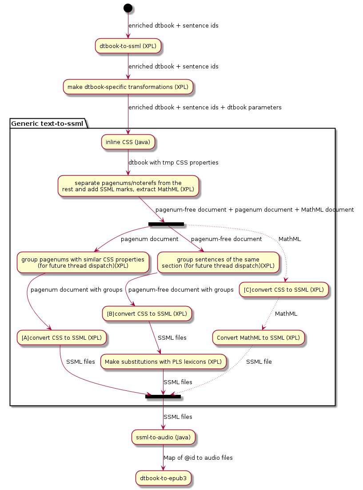

DAISY Pipeline 2 :: TTS Modules
===============================

[](https://travis-ci.org/daisy/pipeline-mod-tts)

TTS-based production modules for the DAISY Pipeline 2


### General Workflow

CSS inlining is performed on the input documents, while NLP and TTS tasks are always performed on the output documents. For instance, in the dtbook-to-epub3 script, CSS is inlined in the DTBook document while NLP and TTS are run on the HTML files.
This is so because:
- We don't want to risk losing @id's in the process of converting DTBook to Epub3. @id's are our only links to audio clips ;
- Some new text might have been generated during the conversion, e.g. "table of contents" ;
- Some text might have been moved apart without their surrounding structure, which may include @id's ;
- Although it would be way simpler to also apply CSS on the output documents, users are only fully aware of the input document, so it makes sense for them to write a stylesheet targeted for the input. CSS information is carried by special attributes that hopefully won't be discarded during the conversions.

At the end, the TTS step returns a list of audio clips such as this one:

```xml
<audio-clips xmlns="http://www.daisy.org/ns/pipeline/data">
   <clip idref="std1472e384061"
         clipBegin="0:00:00.000"
         clipEnd="0:00:00.581"
         src="file:/tmp/section0508_0000.mp3"/>
   <clip idref="std1472e384067"
         clipBegin="0:00:00.581"
         clipEnd="0:00:01.257"
         src="file:/tmp/section0508_0000.mp3"/>
</audio-clips>
```

@idref is the id of an element of the original document: most likely a sentence, sometimes a skippable element. The map is then provided to whichever script that requires it to generate SMIL-like files. The conversion scripts are supposed to call `px:rm-audio-files` after everything has been copied to the output directory.

### Skippable Elements

A skippable element is any XML element that we want to be processed separately, after being moved to a dedicated SSML sentence. It allows us to:
- use a different voice or engine for this particular kind of element.
- run different XProc/XSLT scripts on them. This is partly the reason that MathML islands are skippable.
- know the boundary (in seconds) of the skippable elements within the audio clips.

This latter feature is convenient to follow the Daisy3 specs, according to which the SMIL files must allow users to skip the utterance of the pagenums, annorefs and noterefs. Thus, those elements have to be declared as skippable, but that would do no harm to declare more of them. The only drawback is that skippable elements won't fit well with the sentences they belong to, because of the change of prosody, and that it requires inserting SSML marks which are not supported by every TTS processors.

### Modules

The text to SSML conversion is done in XProc. The CSS inlining and the conversion from SSML to audio clips are done in Java.


[plantuml source](tts.uml)

Note that if a sentence contains nothing more than a single skippable element, the skippable element won't be extracted and will be treated as a regular sentence inside the skippable-free document.

After the step "project CSS onto sentences", the XML transferred from one transformation to another always looks like:

```xml
<speak version="1.1" xmlns="http://www.w3.org/2001/10/synthesis">
       <s id="fj73d78f">...</s>
       <s id="fd998h3m">...</s>
</speak>
```

### SSML Partitioning

Before dispatching the sentences to threads, ssml-to-audio groups them together by packets of 10 or so. The goal here is to make it likely to encode adjacent text in the same audio files. This can be improved in future versions by:
- taking into consideration the size of the SSML sentences
- building packets according to levels, sections and chapters. This was actually the behavior of Pipeline1.8 and 1.9, but it comes with a cost regarding the coupling between ssml-to-audio and text-to-ssml, plus the post-processing when chapters are too big to take benefit of the multithreaded architecture.

Once the SSML sentences are gathered in packets, packets are ordered in such a manner that the packet-consumer threads should finish simultaneously.

### Multi-threading and memory management

There are threads for synthesizing text and other threads for the audio encoding. Separating tasks has the advantage of speeding up a bit some adapters such as Acapela's. In the Acapela adapter, a TCP channel is opened for each thread, but Acapela's licenses set a limit of speed for every channel (i.e. an output rate in bytes per TCP socket). So either we open, initialize and close channels for every request sent to Acapela's server, or we let the channels open but we make sure to keep them busy so that we never find ourselves not using the maximum rate that Acapela granted us, as when we are encoding audio. In that way, threads dedicated to synthesizing get close to the speed limit.

The drawback of this method, by contrast to synthesizing and encoding in the same threads, is that it may lead to memory overflows if the encoding threads are slower than the synthesizing ones. To address this problem, the size of the audio queue is limited by the permits of a semaphore, which is shared by all the running jobs.

Yet there can remain memory issues if all the synthesizing threads wait for the semaphore at the same time with full audio buffers. We can't use another semaphore to limit the production of audio buffers because, if the threads reach the memory limit before reaching the flushing point -when they send their data to the encoding threads-, the encoding threads will starve. Instead, if the memory limit is reached, a custom memory exception is thrown, before an authentic OutOfMemoryError is thrown from an unexpected place. The exception doesn't stop the thread from trying to synthesize the next pieces of text.

Both mechanisms are handled by an AudioBufferAllocator that counts every byte allocated and deallocated.

Audio buffers can contain any kind of data (8-bits, 16-bits, 8kHz, 16kHz and so on). The current format is determined by the TTS engine that produced the data. Since the buffers are flushed when formats change, there is no need for re-sampling the data.

### Voices

The voice-family CSS property allows users to specify which voice and TTS engine they want to use. If the voice is not found, if the TTS engine is provided without the voice name, or if nothing at all is provided, ssml-to-audio will ask the Voice Manager which voice is the best match for the requirements (e.g. language and TTS engine).

The algorithm of voice selection -currently in VoiceManager.java- can be a bit confusing. It works as follows:

##### case 1: one or more criteria are supplied: language, gender, engine

To reply to such a request, the Voice Manager precomputes 4 lists, each ordered by descending priority:
- one that tries to match language, gender and engine
- one that tries to match language and engine
- one that tries to match language and gender
- one that tries to match language only

The algorithm checks the given criteria against these lists one after the other and returns the first voice that matches.
In other words, a low-priority voice V1 will be chosen over a high-priority voice V2 if V1 is provided by the engine requested by the end-user.

If no voice is found, it will return the best voice that provides the language "*", if there is any such voice registered. These voices are called "multi-lang voices." in the code.

##### case 2: the full name of the voice is supplied by the end-user

If the name is found, the corresponding voice is simply returned. If it isn't, the Pipeline will try finding a similar voice as long as it is aware of the characteristics (gender, engine and language) to look for, i.e. those of the voice that cannot be found.

The link between a voice and its fallback counterpart is precomputed and stored in a map. Although this map would theoretically do the same job as in the 1st case, the code of the 1st case is not used for generating the map (this is an enhancement that we could think about). The only difference is that multi-lang voices compete with regular voices within the 4 lists.

If yet not fallback voice is found, the algorithm will ignore the voice explicitly requested and instead extract new criteria from the 'voice-family' attribute. If other criteria do exist, then it will switch to case 1.

##### case 3: a voice has been selected, but it doesn't work on the current sentence because of a timeout or for any other reason

This case is equivalent to the case 2 when the voice is not found.

### Skippable elements and audio clips

The skippable elements must be separated from their sentence so that the readers can disable them without damaging the prosody.

When the TTS modules get the DTBook, some previous step should already have wrapped the text with span elements when there are skippable elements involved, e.g. a DTBook noteref:
```xml
<sent id="sent1"><span id="span1">begin</span><noteref id="ref1">note1</noteref><span id="span2">end</span></sent>"
```

And, if there are any annotations on <sent> and/or <noteref>, they will be inserted that way:
```xml
<sent id="sent1">pre-annotation-of-sent1 <span id="span1">begin</span><noteref id="ref1">note1 post-annotation-of-note1</noteref><span id="span2">end</span></sent>"
```

Having said that, one of the first step of text-to-ssml is to replace the noteref with a SSML mark:
```xml
<sent id="sent1">pre-annotation-of-sent1 <span id="span1">begin</span><ssml:mark name="span1__span2"><span id="span2">end</span></sent>"
```

The sentence can then be pronounced with the right prosody.

The mark's name contains information about where the sub-sentences begin and where they end. Ssml-to-audio uses this information to produce two clips in the audio-map:
```xml
<audio-clips xmlns="http://www.daisy.org/ns/pipeline/data">
   <clip idref="span1"/>
   <clip idref="span2"/>
</audio-clips>
```
"pre-annotation-of-sent1" will belong to the first clip.

As for the the skippable elements, they are transferred from their host sentence to a separate document dedicated to them. In order to save resources, we group them together in long sentences such as this one:
```xml
<ssml:s>note1 post-annotation-of-note1<ssml:mark name="ref1__ref2">note2<ssml:mark name="ref2__ref3">note3</ssml:s>"
```

Just as for regular sentences, ssml-to-audio will add three clips in the audio-map:
```xml
<audio-clips xmlns="http://www.daisy.org/ns/pipeline/data">
   <clip idref="ref1"/>
   <clip idref="ref2"/>
   <clip idref="ref3"/>
</audio-clips>
```

### Job Cancellation

Running jobs cannot be canceled yet, but it can happen that the Pipeline2 server is requested to stop gracefully. The TTS modules are built so that the TTS resources can be invalidated during running jobs. In such cases, the TTS threads will keep popping text packets but they won't process them. As a result, they will exit quickly and the deallocation callbacks will be called no matter what problems occurred.

### MathML

The conversion from MathML to SSML is based on MathML3.0 specs. Almost everything regarding MathML is in the module mathml-to-ssml. Minor things, such as annotations and extraction, are done in module text-to-ssml.

Direct conversion from Content MathML is not handled yet. For now, Content MathML is converted into Presentation MathML using a third-party XSLT.
Pres MathML conversion is in-house though, and is performed from a single XSLT so it can be readily employed in other projects.

The conversion relies on an external XML file that defines how to deconstruct MathML, much as how you would extract information using regexp groups and build language-dependent SSML from the matching groups.
Internally, these rules are indeed converted into regexps, thus everything that can't be done using regexps, can't be done with those rules either.
It would have been more powerful with XSLT rules, but regexp-like rules has been preferred for the sake of simplicity, especially when it comes to combining matching and extraction.

Although there are rules to convert ASCII symbols (e.g. '+' and '-'), there aren't rules to convert complex UTF-8 symbols such as ℝ and ∬. It is the responsibility of the TTS processors to properly pronounce such symbols. eSpeak has a limited preset of symbols, whereas Acapela seems to pronounce them all. It has never been tested with other engines.


###

### Known Limitations

- Relative CSS properties (e.g. increase/decrease volume) are not interpreted;
- SSML elements outside the scope of sentences are not kept;
- TTS engines that cannot handle SSML marks, such as eSpeak, will produce audio with wrong prosody and we won't be able to automatically check that the input text has been entirely synthesized;
- Remote TTS engines must share the same configuration (installed voices, sample rates etc.) or at least the 'master' server must be configured with the minimal configuration;
- TTS processors can provide different audio formats, but the same engine must always provide the same format. If different voices of the same processor use different formats, it is the responsibility of the TTS adapter to re-sample the data before sending them to the TTS threads;
- When a TTSService is stopped, the TTSRegistry acknowledges the stop but keeps a reference to it until all the releasing callbacks have been called, which is not exactly what one would expect from an OSGi bundle.
- There isn't a way for end-users to pass custom XML markups from their books to TTS processors. If there is any non-SSML nodes in the input, they will be filtered out in text-to-ssml. Even if they were left intact by text-to-ssml, they risk being removed by the SSML serializers of the TTS engines' adapters.