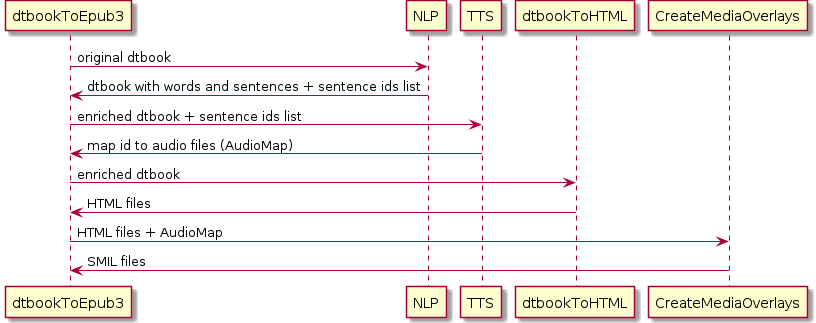
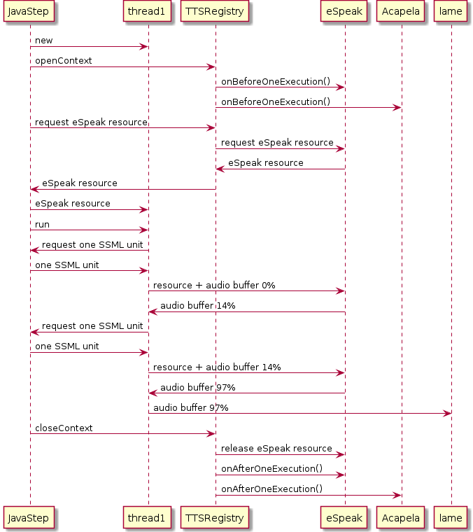
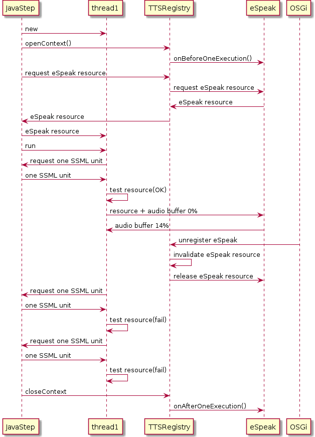

DAISY Pipeline 2 :: TTS Modules
===============================

[](https://travis-ci.org/daisy/pipeline-mod-tts)

TTS-based production modules for the DAISY Pipeline 2


### General workflow

NLP and TTS tasks are performed on the original documents. At the end, the TTS step returns a list of audio clips such like this one:

```xml
<audio-clips xmlns="http://www.daisy.org/ns/pipeline/data">
   <clip idref="std1472e384061"
         clipBegin="0:00:00.000"
         clipEnd="0:00:00.581"
         src="file:/tmp/section0508_0000.mp3"/>
   <clip idref="std1472e384067"
         clipBegin="0:00:00.581"
         clipEnd="0:00:01.257"
         src="file:/tmp/section0508_0000.mp3"/>
</audio-clips>
```

@idref is the id of an element of the original document: most likely a sentence, sometimes a skippable element (not contained in any sentence). The map is then provided to whichever script that requires it to generate SMIL-like files.



[plantuml source](dtbook-to-epub3.uml)

### Modules

A small part of the job is done in XProc. The CSS inlining and the conversion from SSML to audio clips are done in Java. Conversion from MathML to SSML (in XProc) is not finished yet.


[plantuml source](tts.uml)

### ssml-to-audio

Every execution of a pipeline job calls the following TTSService's callbacks in that order:
- onBeforeOneExecution
- allocateResource for every thread
- releaseResource for every thread
- onAfterOneExecution

No resource will be allocated if onBeforeOneExecution fails, e.g. because it can't connect to a TTS Server or cannot find a synthesizer binary.

The step starts all the threads after all the resources have been allocated. ReleaseResource callback is not called before every thread has finished so as to let users easily distinguish between the different stages, unless TTSServices explicity set the flag which tells that their resources have to be released as soon as possible.

If no such flag is set:


[plantuml source](ssml-to-audio.uml)

If a TTSService is unplugged earlier than expected, then the resources will be released earlier, however the callbacks will remain the same.



[plantuml source](stop.uml)

### SSML Partitioning

Text-to-ssml module is responsible for converting the text and partitioning the SSML into multiple files on which ssml-to-audio relies to dispatch the SSML over the threads. The partitioning is performed according to structural elements such as DTBook levels. The only constraints are that sections must not be dispatched over different partitions, and partitions must contain only contiguous text, so that the final mp3 files will roughly correspond to sections of the original document.

Ssml-to-audio module is free to split the partitions into smaller parts as long as the partitions are not merged together. As a result, the mp3 files will be smaller. They are indeed split when the audio format changes or when the sections are too big to get the most out of the multi-threading architecture. The resulting small parts are then stored in a central queue. The threads pop one by one the elements of the queue when they are not busy.

### Audio Buffers

Every thread has its own pre-allocated audio buffer with a writing offset. The TTSServices fill the buffers after the offset. If the buffers are to small, they can allocate a new one, which should be avoided. When they are full, or when the current section is entirely processed, the buffers are passed to the current audio encoder and flushed. The buffers can contain any kind of data (8-bits, 16-bits, 8kHz, 16kHz and so on). The current format is determined by the TTS engine which produced the data. Since the buffers are flushed when formats change, there is no need for re-sampling the data.

### Voices

The voice-family CSS property allows users to specify which voice and TTS engine they want to use. If the voice is not found, if the TTS engine is provided without the voice name, or if nothing at all is provided, ssml-to-audio will ask the TTSRegistry which voice is the best match for the requirements (i.e. language and TTS engine). This is why TTSRegistry includes an array of voices ordered by their rating. This array can be extended with a system property.

### Skippable elements and audio clips

The skippable elements must be separated from their sentence so that the readers can disable them without damaging the prosody.


Recall that the NLP step has wrapped the text with span elements when there are noterefs involved (for DTBooks):
```xml
<sent id="sent1"><span id="span1">begin</span><noteref id="ref1">note1</noteref><span id="span2">end</span></sent>"
```

One of the first step of text-to-ssml is to replace the noteref with a SSML mark:
```xml
<sent id="sent1"><span id="span1">begin</span><ssml:mark name="span1__span2"><span id="span2">end</span></sent>"
```

The sentence can then be pronounced with a right prosody.


The mark's name contains information about where the sub-sentences begin and where they end. Ssml-to-audio uses these information to produce two clips in the audio-map:
```xml
<audio-clips xmlns="http://www.daisy.org/ns/pipeline/data">
   <clip idref="span1"/>
   <clip idref="span2"/>
</audio-clips>
```

If a sentence doesn't contain any skippable elements, it will be referred by a single audio clip in the audio-map. Otherwise, its @id won't be found in the list of audio clips (see example above).


The contents of the skippable elements are grouped together and copied to a separate document. Such document contains sentences with juxtaposed SSML marks such as the following one:
```xml
<sent>note1<ssml:mark name="ref1__"></sent>"
```

The same mechanism is at work to build the noteref's audio clip.


### Known Limitations

- Has only been tested with DTBook documents;
- Although the Java code is multi-threaded for single jobs, multiple jobs won't run in parallel. They will wait for the TTSRegistry's lock to be released instead. Usually that doesn't make any difference unless the jobs use different TTS engines;
- Relative CSS properties (e.g. increase/decrease volume) are not interpreted;
- SSML elements outside the scope of sentences are not kept;
- TTS engines that cannot handle SSML marks, such as eSpeak, will produce audio with wrong prosody and we won't be able to automatically check that the input text has been entirely synthesized;
- Remote TTS engines must share the same configuration (installed voices, sample rates etc.) or at least the 'master' server must be configured with the minimal configuration;
- TTS vendors can provide different audio formats, but the same vendor must always provide the same format. If different voices of the same vendor use different formats, it is the responsibility of the vendor to re-sample the data before sending them to the TTS adapters;
- When a TTSService is stopped, the TTSRegistry acknowledges the stop but keeps a reference to it until all the releasing callbacks have been called, which is not exactly what one would expect from an OSGi bundle.
