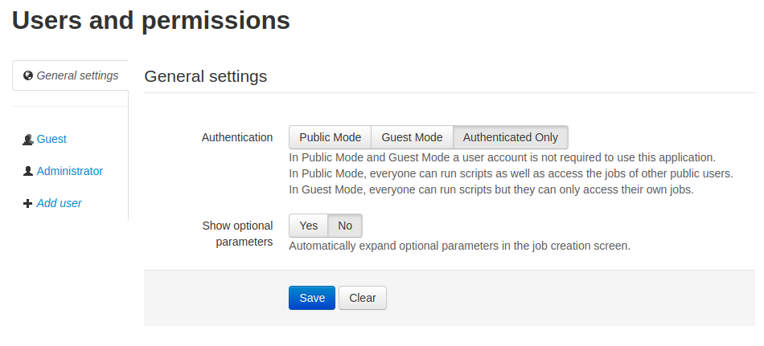
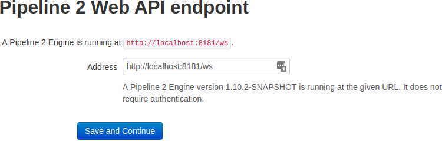
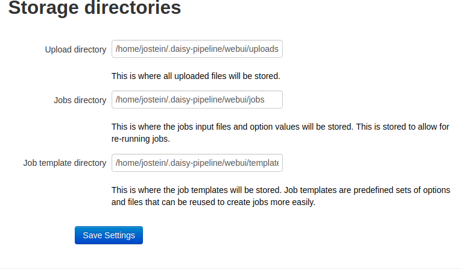
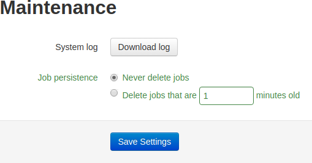

# Administrator Settings

## Users and Permissions

<table role="presentation"><tbody>
<tr><td>

The "Users and Permissions" tab lets you configure who gets access to the Web UI. The "General settings" contains two items:

<ul>
<li>
<strong>Authentication</strong>: There are three modes; Public, Guest and Authenticated.

    <ul>
    <li>In authenticated mode, only users with a username and password can log in. If your server is available on the web, this is most likely the mode you will want to use. It is also the default mode.</li>
    <li>In guest mode, users will be presented with the login page, but has the option of logging in as a guest. Guests do not see eachothers jobs in the jobs listing.</li>
    <li>In public mode, users are automatically logged in as a public user. Public users can see eachothers jobs in the jobs listing.</li>
    </ul>
</li>
<li>
<strong>Show optional parameters</strong>: If you find that you need to use optional parameters of a script a lot (when creating jobs) then you may want to enable the "Show optional parameters" option so that you don't have to expand the parameter groups all the time.
</li>
</ul>
</td><td></td></tr>
</tbody></table>

### Authenticated Mode

The "Add user" link lets you create a user. Users are uniquely identified by their e-mail address.

If e-mails are enabled under "E-mail settings" then you don't have to provide an initial password. Instead, the user that was created will receive an e-mail with a link to where they can set a password and activate their account.

The name of the user that was created will appear in the list of users on the left side of the "Users and permissions" tab in "Admin settings". You can change the details of the user here, as well as re-send the activation e-mail in case the user didn't get the previous e-mail. If the user has forgotten their password, then a new "forgotten password" e-mail can be sent from here as well. The user can also do this themselves on the login page.

The difference between normal users and administrator users is that administrators have access to the "Admin settings", and can see the jobs from all users. Normal users can only see their own jobs in the jobs listing.

Users can change their own account details from the account page, which is available by clicking their own name right next to the "Log out" menu item in the top navigation bar.

### Guest Mode

In addition to authenticated users, guests without a username can also use the Web UI if the Web UI is running in guest mode. Guest mode can be useful if you want to let users try the Web UI without having an account.

In guest mode, there will be a button on the login page that lets you log in as a guest.

By clicking the name of the guest in the list of users under the "Users and permissions" tab in the "Admin settings", you can change the name of the guest user to something else.

Guests cannot list jobs. Instead, if e-mail is enabled, the guest can fill in their e-mail address when creating a job and get an e-mail with a link to the job they create so that you can access the job later.

### Public Mode

In public mode, everyone is automatically logged in as a public user and redirected to the "Create Job" page. Public mode is useful if the Web UI is installed behind a firewall for use inside an organization, where requiring users to log in might not be very useful.

All public users have access to the jobs created by other public users.

## Scripts

<table role="presentation"><tbody>
<tr><td>Under "Scripts", you can choose which scripts to make available to the users. This is useful if you want to clean up the list of jobs so that it is easier to create jobs, or if you want to prevent users from using certain resource intensive scripts.</td><td></td></tr>
</tbody></table>

## Pipeline 2 Web API

<table role="presentation"><tbody>
<tr><td>Under the "Pipeline 2 Web API" tab you can configure the Pipeline 2 Web API endpoint you want to connect to.</td><td></td></tr>
</tbody></table>

## Storage directories

<table role="presentation"><tbody>
<tr><td>Uploaded files, jobs, and templates, need to be stored somewhere. The default location is under the installation folder for the Web UI. You can change these directories here, for instance if you want to use a bigger disk on the server.</td><td></td></tr>
</tbody></table>

## E-mail Settings

<table role="presentation"><tbody>
<tr><td>
If you enable e-mails then users can retrieve lost passwords, and guest users can get a link to their jobs.

If you have a Gmail account you can simply enter your username and password in the Gmail panel.

You can configure any other SMTP server manually in the "SMTP" panel.
</td><td></td></tr>
</tbody></table>

## Maintenance

<table role="presentation"><tbody>
<tr><td>
In the "Maintenance" tab you can set up automatic deletion of jobs after a certian duration. This is useful if there is a lot of jobs, or if the jobs contain big books (i.e. audio books), and you want to preserve disk space.

There is also a link to download the system log, which can be useful for debugging.
</td><td></td></tr>
</tbody></table>

## Appearance

<table role="presentation"><tbody>
<tr><td>Under "Appearance" you may change the title and visual theme of the Web UI. The title is what appears to the left in the top navigation bar, and as the tab or window title in the browser. Visual themes change the colors and fonts of the Web UI. More information on how to create themes can be found in the Web UI Branding guide.</td><td></td></tr>
</tbody></table>
