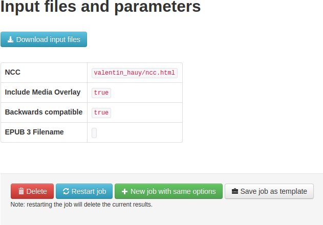
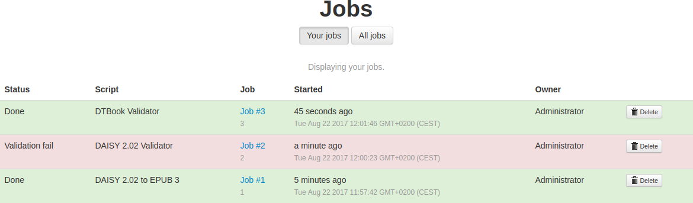

# Web User Interface Guide

## Create Job

<table role="presentation">
<tr><td>Clicking the "Get Started" button on the welcome screen, or the "Create Job" item in the top navigation bar, will take you to the page where you create jobs.</td><td></td></tr>
<tr><td>
On the right, a list of scripts are displayed. On the left, you can upload files.

Now, click "Upload Files" (or drag-and-drop) to select the document you want to validate or transform. ZIP-files are treated as directories. If you want to upload a directory structure, the files has to be zipped.
</td><td></td></tr>
<tr><td>Select the script you want to use.</td><td></td></tr>
<tr><td>After choosing a script, you will be taken to the options panel.</td><td></td></tr>
<tr><td>
More options can be displayed by clicking "Show" next to the option group title.

Click "Start job" to start the job.

When the job is started you will be redirected to the "Job View" page and see that it is "Running".
</td><td></td></tr>
</table>

## Job View

You can access this page through the "Jobs" menu item in the navigation bar at the top of the page.

<table role="presentation">
<tr><td>
A new job will either be "Running" or "Queued". The Pipeline 2 engine will by default allow at most two jobs to run at the same time. If you create more jobs, those jobs will be queued.

If the job succeeds, the status will change to "Success".

If there is a validation error, the status will change to "Validation failed".

If an error occurs during transformation, the status will change to "Failed".
</td><td></td></tr>
<tr><td>
When a job completes without errors, the results from jobs can be downloaded through download links that appear under the "Success" state.
</td><td></td></tr>
<tr><td>Just below the "Job Summary" headline, you can click "Show details" to get more technical info about the job, such as its ID, and when it was started.</td><td></td></tr>
<tr><td>
Further down the page, there may be a validation report, or another type of report depending on which script the job were running.
</td><td></td></tr>
<tr><td>
You can check the execution log to see what kind of tasks the job has performed. This is especially useful when a job fails so that you can determine why it failed.

A link is also provided to a more detailed log. The detailed log is a text file with more technical information. If you encounter a problem while executing job and want to ask for help, you should ideally attach the detailed log and if possible also the input fileset and arguments used.
</td><td></td></tr>
<tr><td>
At the end, there are links to download the input files, and a list of what parameters were used to run the job. There are also shortcuts for restarting the job, and for creating a new job with the same inputs and parameters.
</td><td></td></tr>
</table>

## Jobs List

<table role="presentation"><body>
<tr><td>By clicking the "Jobs" item in the top navigation menu you will be presented with a list of jobs. Normal users will see only their own jobs, while administrators can see everyones jobs.</td><td></td></tr>
</body></table>

## Templates

For more information on templates, see the [Templating documentation](Templating).

## About Page

<table role="presentation"><body>
<tr><td>The about page contains a description of what DAISY Pipeline 2 is as well as external links to where you can find more information and get support. At the bottom, the version of the currently running Pipeline 2 engine and the Web UI are displayed.</td><td></td></tr>
</body></table>

## Account settings

<table role="presentation"><body>
<tr><td>In the account settings you can change your name, email and password.</td><td></td></tr>
</body></table>

## Admin Settings (for administrators)

Administrators have access to the "Admin settings" page, where they can configure several aspects of the Web UI; Users and Permissions, the Pipeline 2 Web API, Upload directory, E-mail settings, Maintenance, and Appearance.

For more info, see the [Administrator settings](Administrator-settings) documentation.
