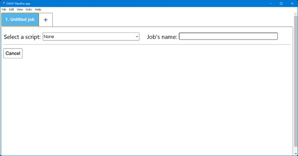
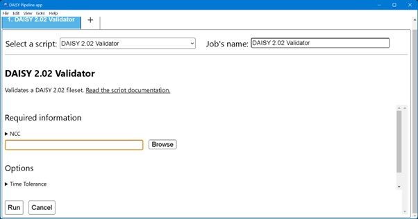
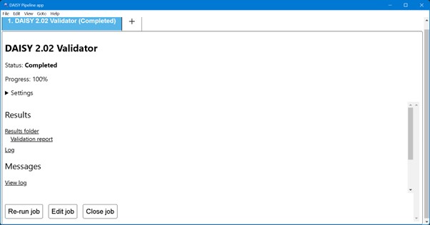
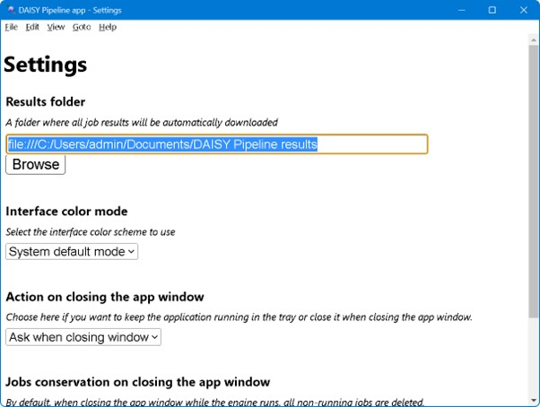

# DAISY Pipeline App Quick Start Guide

This is a graphical user interface for the powerful DAISY Pipeline
engine. It features the following:

- Multiple jobs can be run in the tabbed interface.
- It has automatic high contrast dark mode.
- It has an accessible user interface with basic keyboard
  shortcuts. For screen reader users, navigation is similar to reading
  web pages.

DAISY Pipeline App can be installed on Windows and macOS.

## Overview of the User Interface

DAISY Pipeline has a menu bar at top. The File, Edit, View and Help
drop down menus can be accessed with the mouse and keyboard like other
applications.

Below the menu is the tab control area. By default there is only one
tab and a “+” shape button for adding more tabs. New conversion jobs
can be created in different tabs and can be run in parallel.

In each tab there is a “Select a script” drop down list. When no
script is selected, the rest of the DAISY Pipeline window is blank.

After selecting a script you will see a short description of what it
does.

Below the description is the “Required information” section. It has
“Browse button” to select the input file. After a file has been
selected, the file path and name is displayed on the side of the
Browse button.

Depending on the selected script there may be an “Options” section
which has various fields to be completed. The name and number of
fields in this section varies for each script.

There is a “Run” button to start the conversion process.

Note that the Job tab name changes to the name of the selected script.

On running a script, “Job status” is shown at the top. It can read
“Running” or “Error” or “Completed”

When the job is completed, the DAISY Pipeline window displays three
sections, namely:

- Settings – Displays the input file name and options selected for the
  job
- Messages – Displays various progress messages of the script
- Results – Contains links to Validation report, log and output

## Using DAISY Pipeline App

- Start the Pipeline App and wait for the Pipeline engine to start
- Choose a script and fill out the appropriate fields
- Run the job and observe its progress and results
- Click the “Show results folder” if the conversion is completed
  successfully to view the output.

## App Settings

The job results are automatically save in the folder named “DAISY
Pipeline results” in the Documents folder. You can change the default
folder in Settings. To do this, go to the File menu and click on
Settings. The Settings window opens as seen below.

- Click on Browse and select the folder in which you want to save the
  output.
- You can also change the user interface appearance by choosing Dark
  mode or Light Mode or the System default.
- In this Settings window you can also choose what will happen on
  closing the app window. The options are: Keep running in the system
  tray, Close the application or Ask while closing the app.
- There are two options for Jobs conservation at the time of closing
  the app; Keep all jobs opened or Close all non-running jobs
- Click on Save button to save your selected choices

## Keyboard shortcuts

### Windows

- Control + N to add a new job
- Control + R to run a job
- Control + Tab and Shift + Control + Tab to move between jobs
- Control + Alt + 0-9 to access the first 10 tabs quickly (1 = first tab, 0 = tenth tab)
- Shift + Control + I to get job status
- Control + D to close a job
- Control + W to close the window
- Control + , to open the settings dialog
- Control + E to edit a job
- Control + = to zoom in
- Shift + Control + = to zoom out
- Alt + Shift + Control + = to reset the zoom level

### Mac

- Command + N to add a new job
- Command + R to run a job
- Control + Tab and Shift + Control + Tab to move between jobs
- Command + Alt + 0-9 to access the first 10 tabs quickly (1 = first tab, 0 = tenth tab)
- Shift + Command + I to get job status
- Command + D to close a job
- Command + W to close the window
- Command + , to open the settings dialog
- Command + E to edit a job
- Command + + to zoom in
- Command + – to zoom out
- Command + 0 to reset the zoom level