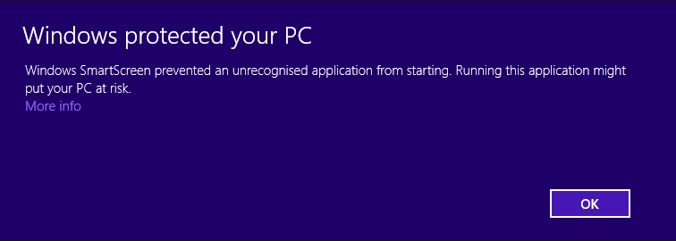
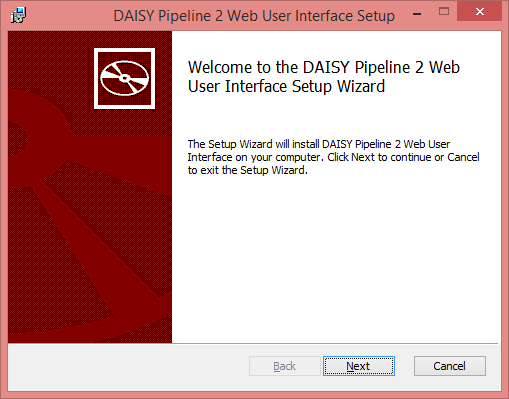
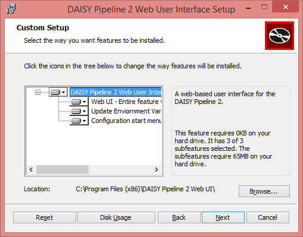
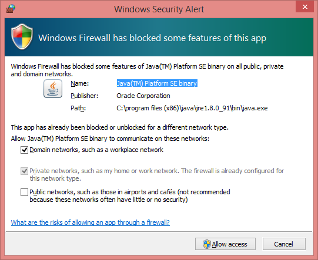
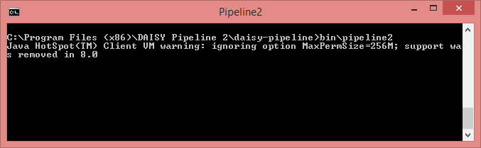
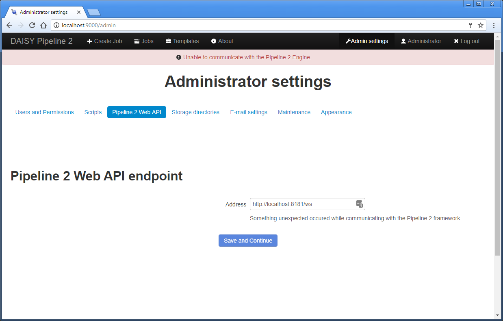

The Pipeline 2 Web UI is a standalone application, intended to be run on a server.
By default it is assumed that it is running on the same server as the Pipeline 2 engine,
which is the recommended setup.

If you install the Pipeline 2 engine on your personal computer, it is recommended that you
use the Pipeline 2 Desktop GUI instead.

## Installation

First, make sure Java 8 (or newer) is installed. Then, [download and run the installer for your operating system](http://daisy.github.io/pipeline/Download.html).

In Linux, the Web UI will be installed as a service. To check the status of the service in Ubuntu, run the command `sudo service daisy-pipeline2-webui status`.

The Linux installers are command line based, and are installed like any other package for Linux. The following is a walkthrough of the graphical Windows installer, as it appears in Windows 7.

<table role="presentation">
<tr><td>Run <code>webui-*.msi</code> to start the installer. Windows will try preventing you from installing the Web UI. Click "More info".</td><td></td></tr>
<tr><td>A button named "Run anyway" will appear. Click it.</td><td></td></tr>
<tr><td>The installer will start, and show a welcome message. Click "Next".</td><td></td></tr>
<tr><td>The licence agreement will show. If you accept it, click "Next".</td><td></td></tr>
<tr><td>Now you can change the installation directory if you wish. Click "Next".</td><td></td></tr>
<tr><td>To start the installation, click "Install".</td><td></td></tr>
<tr><td>A progress bar will be displayed while it is installing.</td><td></td></tr>
<tr><td>You may get need to give permissions to run the installer. If you get a "User Account Control" popup, just click "Yes".</td><td></td></tr>
<tr><td>When the installation is done, click "Finish".</td><td></td></tr>
<tr><td>The Web UI can be started from the start menu.</td><td></td></tr>
<tr><td>A console window will appear while the Web UI is running.</td><td></td></tr>
<tr><td>The first time you start the Web UI, the Windows firewall may ask for permission to open up for the Web UI. Click "Allow access". By default, the Web UI is running on port 9000 on the server.</td><td></td></tr>
</table>

## First Use

The first time that you use the Web UI, you will be asked to create an administrative account. You are able to create additional administrators later. This administrator will be named "Administrator", but you can change the name later as well.

There might be a warning message at the top of the Web UI, right under the navigation bar, saying "Unable to communicate with the Pipeline 2 Engine". If this is the case, it means that either the Pipeline 2 Engine is not running, or it is running in a non-standard location.

When starting the Pipeline 2 engine, you must start it from the command line instead of the GUI. Go to the folder where the Pipeline 2 engine is installed, usually `C:\Program Files (x86)\DAISY Pipeline 2\daisy-pipeline` on Windows, or `/opt/daisy-pipeline` on Linux, and run `bin/pipeline2`.

If the engine is already running, but on a non-standard port or on another server, then you need to configure it in the Web UI. Go to "Admin settings" and "Pipeline 2 Web API". Set the endpoint address to the Web API endpoint as necessary. If the Pipeline 2 Engine at the given Web API endpoint requires authentication, you will be required to provide the authentication ID and the secret text as well.

When the engine is running and configured, the Web UI should be ready to use.
